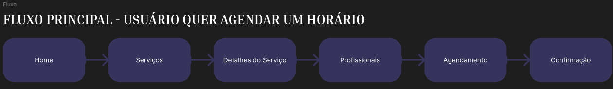
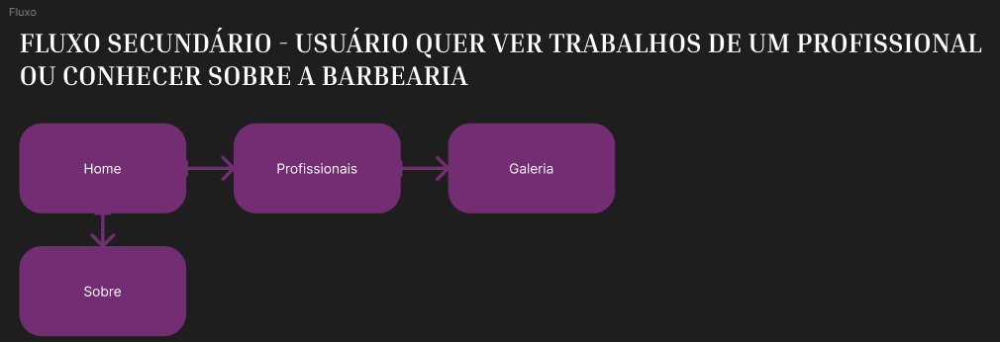
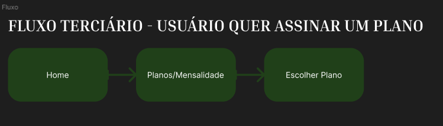

# Barber Club — Fluxos de Usuário (Etapa 1)

## Fluxo Principal
> Usuário quer agendar um horário

```
Home
  ↓
Serviços
  ↓
Detalhes do Serviço
  ↓
Profissionais
  ↓
Agendamento
  ↓
Confirmação
```

Observação: a tela de Agendamento possui um botão "Agendar pelo plano", disponível para quem já é assinante. Tanto o agendamento avulso quanto o agendamento via plano convergem para a mesma tela de Confirmação.



---

## Fluxo Secundário
> Usuário quer conhecer a barbearia ou avaliar um profissional antes de decidir

Dois caminhos independentes, partindo direto da Home:

```
Home
  ↓
Profissionais
  ↓
Galeria (trabalhos do profissional selecionado)
```

```
Home
  ↓
Sobre
```


---

## Fluxo Terciário
> Usuário quer assinar um plano mensal

```
Home
  ↓
Planos/Mensalidades
  ↓
Escolher Plano
```

Observação: este fluxo é isolado — não avança automaticamente para o Agendamento. O usuário retorna à Home ou acessa o Agendamento por conta própria depois de assinar.



---

## Cobertura de telas

| Tela                  | Fluxo(s)                     |
|------------------------|-------------------------------|
| Home                   | Principal / Secundário / Terciário |
| Serviços                | Principal                    |
| Detalhes do Serviço     | Principal                    |
| Profissionais           | Principal / Secundário       |
| Galeria                 | Secundário                   |
| Sobre                   | Secundário                   |
| Agendamento             | Principal                    |
| Confirmação             | Principal                    |
| Planos/Mensalidades     | Terciário                    |