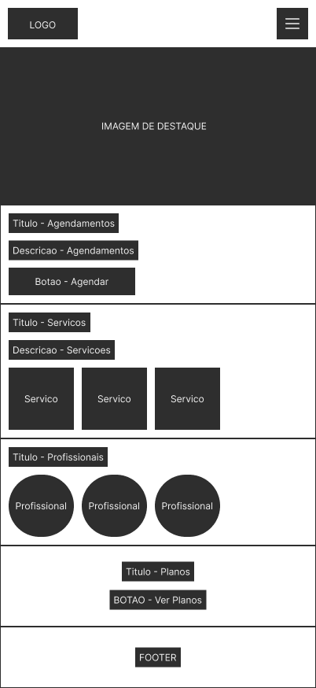
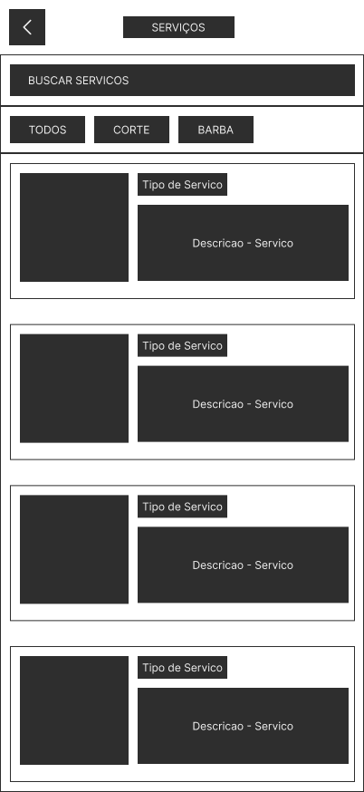
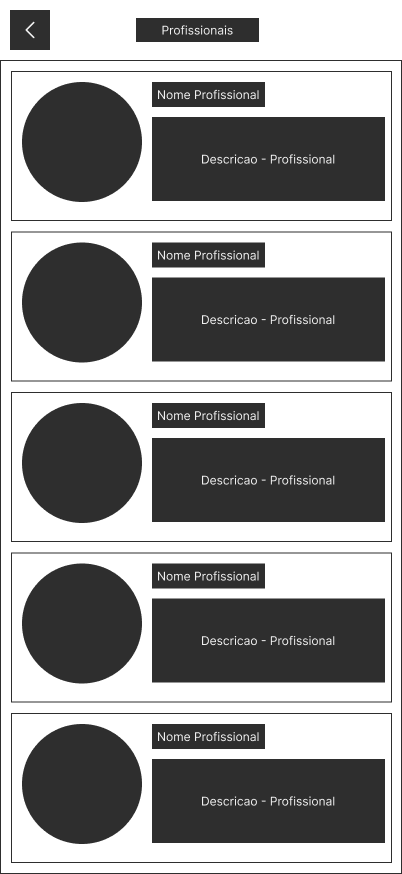
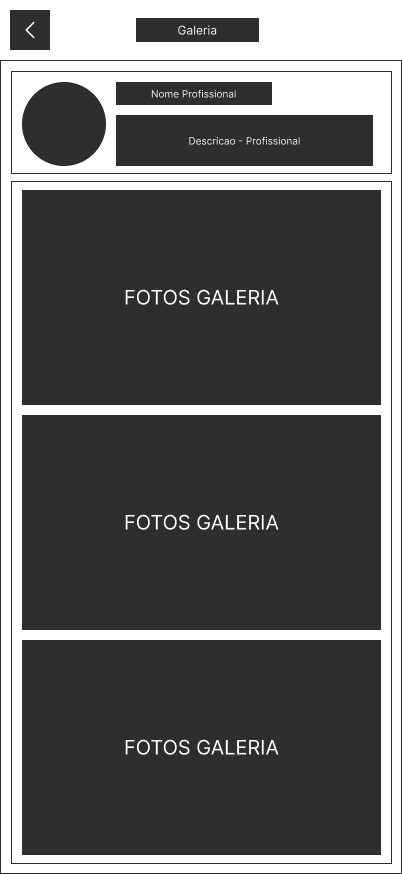
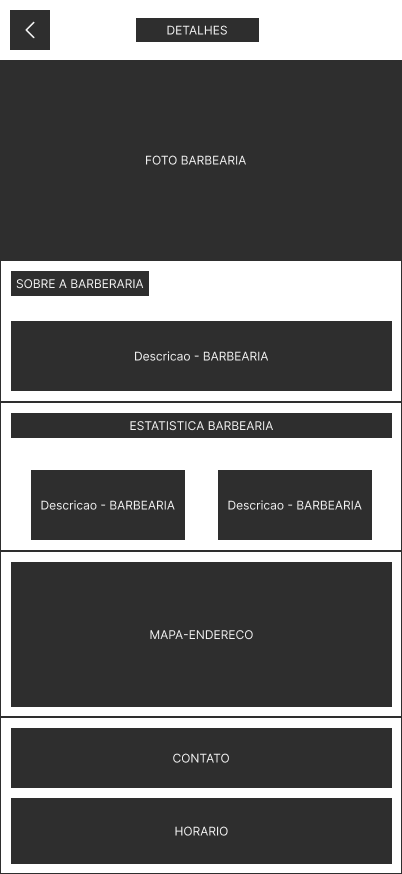
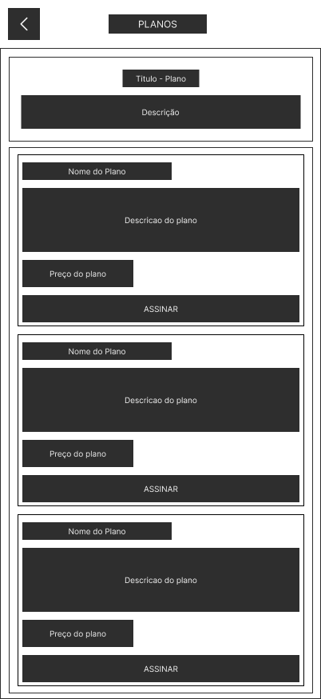
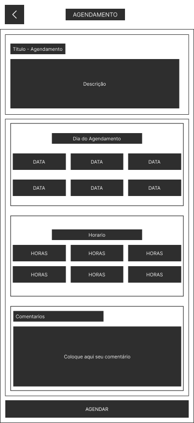
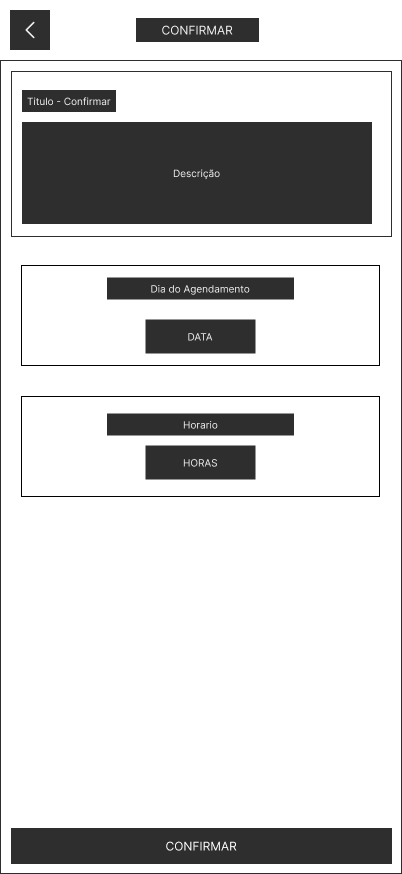

# Wireframes — Barberia PD Case

## 1. Objetivo

Esta etapa tem como objetivo definir a estrutura das principais telas do projeto antes da criação da interface visual final.

O wireframe representa a organização dos conteúdos, a posição dos elementos e a forma como o usuário irá interagir com cada página.

Nesta etapa, o foco não está em elementos visuais finais como:

- cores;
- tipografia;
- imagens reais;
- ícones finais;
- sombras;
- efeitos;
- identidade visual.

O objetivo principal é validar a estrutura e a organização das informações.

---

# 2. Organização

Os wireframes foram desenvolvidos em duas versões:

- Mobile;
- Desktop.

A versão Mobile serviu como base inicial para a organização das informações.

Posteriormente, as telas foram reorganizadas para Desktop, aproveitando melhor o espaço horizontal disponível.

A adaptação para Desktop não consistiu apenas em aumentar o tamanho das telas Mobile. Os elementos foram reorganizados de acordo com o espaço disponível em cada dispositivo.

---

# 3. Padrões utilizados

## Mobile

Os wireframes Mobile foram desenvolvidos utilizando como referência:

- largura aproximada de `402px`;
- organização predominantemente vertical;
- elementos adaptados para telas menores;
- navegação e ações organizadas de forma compacta.

## Desktop

Os wireframes Desktop seguem como padrão:

- largura de `1440px`;
- altura mínima de `1024px`;
- área central de conteúdo de aproximadamente `1200px`;
- Footer reservado com `90px`;
- maior aproveitamento do espaço horizontal;
- reorganização dos elementos em colunas e grids quando necessário.

---

# 4. Telas desenvolvidas

Foram desenvolvidas as seguintes telas:

1. Home
2. Serviços
3. Detalhes do Serviço
4. Profissionais
5. Galeria
6. Sobre a Barbearia
7. Planos e Mensalidades
8. Agendamento
9. Confirmação do Agendamento

---

# 5. Home

## Mobile



## Desktop


## Adaptação

Na versão Mobile, as principais seções da Home são apresentadas verticalmente.

Na versão Desktop, os elementos passam a utilizar melhor o espaço horizontal disponível, permitindo que conteúdos como serviços, profissionais e planos sejam apresentados de forma mais ampla.

---

# 6. Serviços

## Mobile



## Desktop


## Adaptação

Na versão Mobile, os serviços são apresentados verticalmente.

Na versão Desktop, os serviços foram reorganizados em um grid, permitindo a visualização de mais opções simultaneamente.

A busca e os filtros permanecem na parte superior da página.

---

# 7. Detalhes do Serviço

## Mobile


## Desktop


## Adaptação

A versão Desktop foi dividida principalmente em duas áreas.

### Área esquerda

Apresenta:

- imagem do serviço;
- galeria relacionada ao serviço.

### Área direita

Apresenta:

- informações do serviço;
- preço;
- descrição;
- profissionais disponíveis;
- ação para escolha do profissional.

Essa organização reduz a necessidade de uma página excessivamente vertical.

---

# 8. Profissionais

## Mobile



## Desktop


## Adaptação

Na versão Mobile, os profissionais são apresentados verticalmente.

Na versão Desktop, os profissionais foram organizados em cards distribuídos em um grid.

Cada profissional possui:

- foto;
- nome;
- descrição.

---

# 9. Galeria

## Mobile



## Desktop


## Adaptação

A versão Mobile apresenta as imagens da galeria verticalmente.

Na versão Desktop, as imagens foram organizadas horizontalmente.

As informações do profissional relacionado à galeria permanecem em destaque na parte superior da página.

---

# 10. Sobre a Barbearia

## Mobile



## Desktop


## Adaptação

Na versão Mobile, as informações são apresentadas em sequência vertical.

Na versão Desktop, a estrutura foi reorganizada em blocos.

### Parte superior

- foto da barbearia;
- descrição sobre a barbearia;
- estatísticas.

### Parte inferior

- mapa e endereço;
- informações de contato;
- horários de funcionamento.

---

# 11. Planos e Mensalidades

## Mobile



## Desktop


## Adaptação

Na versão Mobile, os planos são apresentados verticalmente.

Na versão Desktop, os planos são apresentados lado a lado para facilitar a comparação entre as opções disponíveis.

Cada plano apresenta:

- nome;
- descrição;
- preço;
- ação para assinatura.

---

# 12. Agendamento

## Mobile



## Desktop


## Adaptação

Na versão Mobile, as informações são apresentadas em sequência.

Na versão Desktop, a escolha de data e horário foi organizada lado a lado.

# 13. Confirmação do Agendamento

## Mobile



## Desktop


## Adaptação

A tela de confirmação apresenta um resumo das informações selecionadas na etapa anterior.

O usuário consegue conferir:

- data escolhida;
- horário escolhido.

Após conferir as informações, o usuário pode finalizar o processo através da ação de confirmação.

---

# 14. Fluxo entre as principais telas

O conjunto de wireframes representa diferentes partes da experiência do usuário dentro da plataforma.

Um dos principais fluxos é o agendamento:

```text
Home
  ↓
Serviços
  ↓
Detalhes do Serviço
  ↓
Escolher Profissional
  ↓
Agendamento
  ↓
Escolher Data
  ↓
Escolher Horário
  ↓
Confirmar Agendamento
```
# 15. Resultado da etapa

Ao final desta etapa, foram definidos os principais elementos e a estrutura das telas que serão utilizadas no projeto.

Os wireframes permitem visualizar:

- quais informações cada página deverá possuir;
- onde os principais elementos estarão posicionados;
- como as páginas se relacionam;
- como a interface se adapta entre Mobile e Desktop;
- quais ações estarão disponíveis para o usuário.

Com a conclusão dos wireframes, a estrutura das principais telas do projeto está definida e poderá ser utilizada como base para a próxima etapa: o desenvolvimento da interface visual no Figma.


